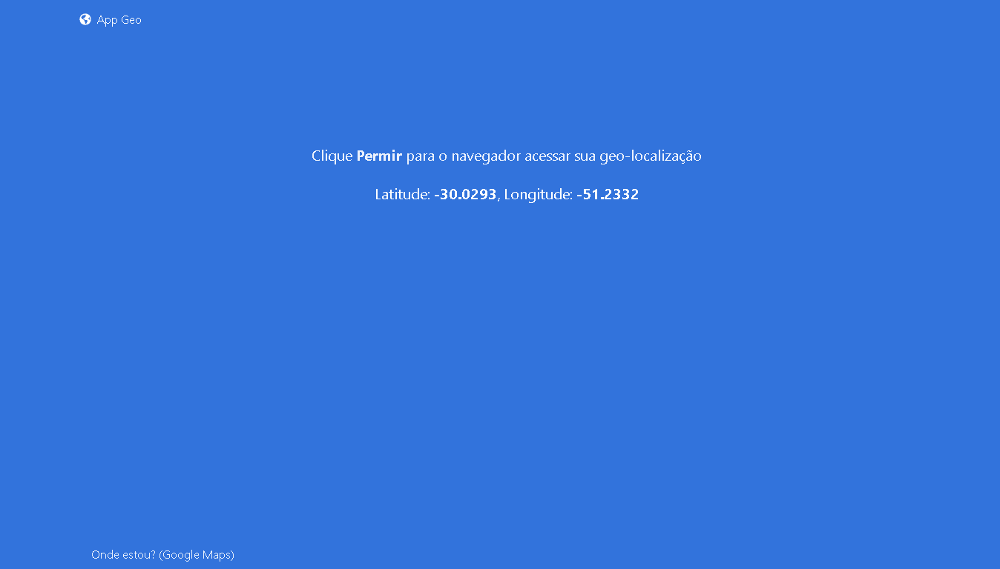

# AppGeo

App para obter a localização do cliente usando [Angular](https://github.com/angular/) (versão 12.2.10) como parte da **grade curricular** do curso de Análise e Desenvolvimento da [UNINTER](https://www.uninter.com).

## DEMO 

## Website
* [AppGeo](https://www.app-geo-uninter.herokuapp.com)